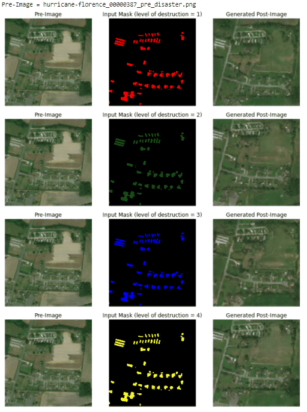

# Overhead-Imagery-Hackathon


## GAN-1 Model Evolution


## GAN-1 Samples Images Generated


## GAN-2 Model Evolution


## GAN-2 Samples Images Generated


## Reproducing the Outputs
Create a virtual environment for the repository.
Install the necessary modules using `pip`.

```pip install -r requirements.txt```

The Python script `generator.py` generates a folder of predicted post disaster images and the modified masks. Each level of destruction is separated into different folders. To run the script, edit the path for `MODEL_PATH` in the Python script and run `python generator.py`.

The script loads the generator model and creates the predicted post disaster images.
